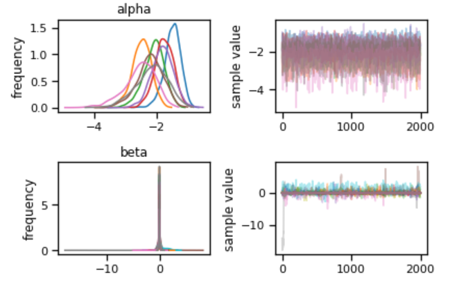

### Hi there 👋

**PiesieAsieduSakyi/Profile** 

Here are some ideas to get you started:
- I am a PhD Student in Data Science at the University of Texas at El Paso
- 🔭 I’m currently working on Bayesian Logistic Regression Model Using a U.S Covid-19 Data
- 🌱 I’m currently learning AI/ML Techniques Applied to Health Disparities
- 👯 I’m looking to collaborate on Research With a Diversity of Researchers
- 📫 How to reach me: epignoginosko@gmail.com

